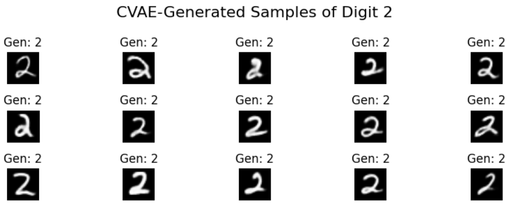
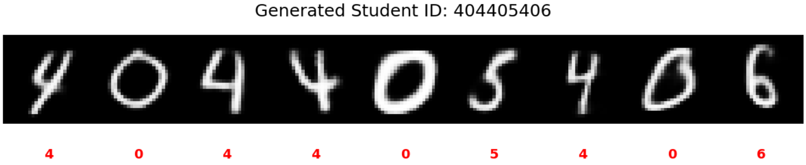
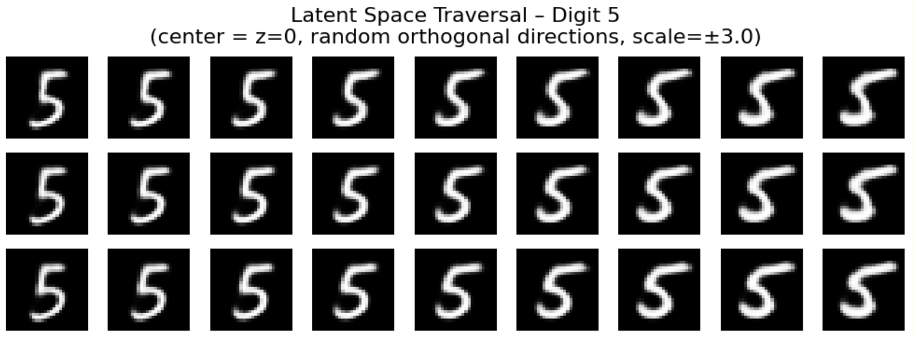
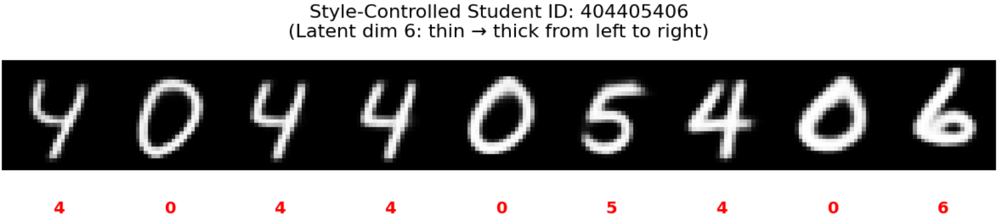

# Conditional Variational Autoencoder (CVAE) on MNIST: Implementation and Exploration

## Overview
This project implements a Conditional Variational Autoencoder (CVAE) for generating and exploring handwritten digits from the MNIST dataset. The CVAE conditions image generation on digit labels (0-9) while capturing style variations (e.g., thickness, slant) in a low-dimensional latent space. The model is trained to maximize the conditional Evidence Lower Bound (ELBO), balancing reconstruction fidelity and latent regularization.

## Process Description
1. **Data Preparation**: Loaded the MNIST dataset using PyTorch's `torchvision`. Visualized examples with one digit per class (0-9) and a random 5x5 batch to confirm data integrity. Images are grayscale (1x28x28) normalized to [0,1].

2. **Model Architecture**:
   - **Encoder**: Convolutional layers process concatenated image and one-hot label, followed by FC layers to output mean (μ) and log-variance (logσ²) for the latent distribution (z_dim=16).
   - **Decoder**: FC layer expands concatenated z and label, followed by transposed convolutions to reconstruct the image.
   - **CVAE Wrapper**: Handles reparameterization trick for sampling z ~ N(μ, σ) during training.

3. **Loss Function**: Negative ELBO minimized via Binary Cross-Entropy (reconstruction) + KL Divergence (latent regularization to N(0,I)).

4. **Training**: Trained for 30 epochs on a DataLoader (batch_size=128) using Adam optimizer (lr=1e-3). Monitored per-example total loss, reconstruction, and KL terms.

5. **Inference and Visualization**:
   - Generated samples for a chosen digit (e.g., 2) in a 3x5 grid.
   - Created a horizontal strip of generated digits matching a 9-digit student ID (e.g., 404405406).
   - Explored latent space with 9x9 traversal grids for digits 0,1,3,5,7,8, varying two random orthogonal directions (±3σ).
   - Generated a style-controlled student ID, progressively varying one latent dimension (e.g., dim=2 for thickness) from thin to thick across the 9 digits.

The implementation uses PyTorch for all components, with device-agnostic code (CPU/GPU). Training converges to stable generations with diverse styles.

## Results and Outputs

### Generated Samples for a Single Digit

    

### Student ID Generation
- Horizontal strip of generated digits for ID 404405406:

    

### Latent Space Traversals

    

### Style-Controlled Student ID
- ID 404405406 with progressive style variation (thin to thick along latent dim 2):  

    

